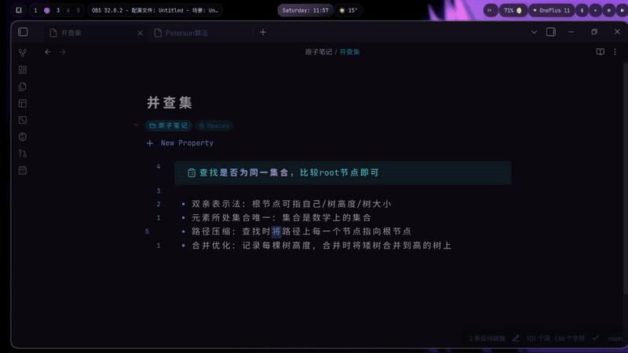
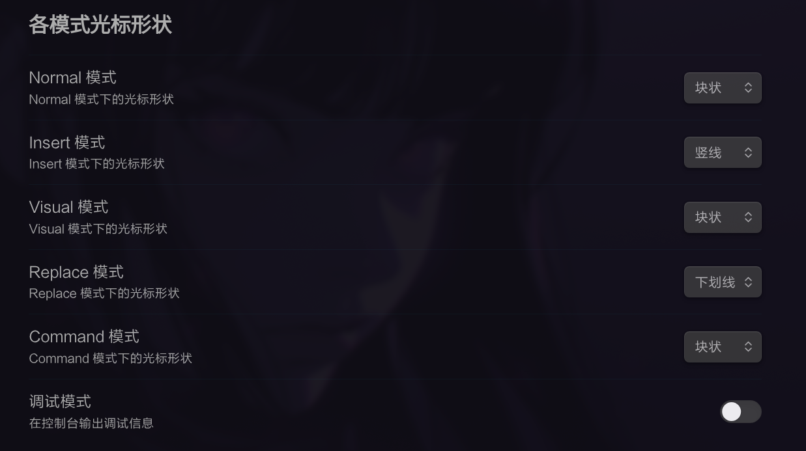

# Smooth Cursor

为 Obsidian 实现平滑光标动画效果的插件，让编辑体验更加流畅优雅。



## ✨ 特性

- 🎯 **平滑光标动画** - 光标移动时具有流畅的过渡动画效果
- 🎨 **多模式支持** - 支持 Normal、Insert、Visual、Replace、Command 等多种 Vim 模式
- 🎭 **自定义光标形状** - 为每个模式独立设置光标形状（块状、竖线、下划线）
- 💨 **输入模式动画** - 在输入文字时提供流畅的光标移动动画
- 🌊 **呼吸动画** - 可选的呼吸效果，让光标更加生动
- 🎨 **高度可定制** - 支持自定义颜色、透明度、动画时长等
- 🚀 **性能优化** - 使用高效的动画引擎，不影响编辑性能

## 📦 安装

### 使用 BRAT 安装（推荐）

1. **安装 BRAT 插件**
   - 打开 Obsidian 设置
   - 进入「第三方插件」
   - 关闭「安全模式」
   - 点击「浏览」，搜索并安装 **BRAT**（Beta Reviewer's Auto-update Tool）

2. **添加此仓库到 BRAT**
   - 打开 Obsidian 设置
   - 进入「已安装插件」中的 **BRAT** 设置
   - 点击「添加 Beta 插件」
   - 选择「从 GitHub 仓库添加」
   - 输入仓库地址：`JuanZoran/obsidian-smooth-cursor`
   - 点击「添加插件」

3. **启用插件**
   - 在「第三方插件」中启用 **Smooth Cursor**
   - BRAT 会自动检测更新并提示你安装新版本

### 手动安装

1. 从 [Releases](https://github.com/JuanZoran/obsidian-smooth-cursor/releases) 下载最新版本的 `smooth-cursor-v*.zip`
2. 解压到你的 Obsidian vault 的 `.obsidian/plugins/smooth-cursor/` 目录
3. 重启 Obsidian 或重新加载插件
4. 在「第三方插件」中启用 **Smooth Cursor**

## 🚀 快速开始


安装并启用插件后，平滑光标动画会自动生效。你可以立即开始体验：

- **光标移动** - 使用 Vim 命令或鼠标移动光标时，会看到平滑的过渡动画
- **输入文字** - 在 Insert 模式下输入时，光标会平滑跟随文字移动
- **模式切换** - 在不同 Vim 模式之间切换时，光标形状会自动变化

## ⚙️ 设置

进入「设置」→「Smooth Cursor - 平滑光标设置」来配置插件：

### 基础设置


- **启用平滑动画** - 开启/关闭光标移动动画
- **动画时长** - 光标移动动画的持续时间（默认：60ms）
- **光标颜色** - 自定义光标颜色（默认：`#528bff`）
- **光标透明度** - 调整光标不透明度（默认：0.8）

### 输入模式动画

- **启用输入模式平滑动画** - 在输入文字时启用光标平滑移动
- **输入模式动画时长** - 输入时光标移动动画时长（默认：30ms）

### 呼吸动画

- **启用呼吸动画** - 为光标添加平滑的呼吸效果
- **呼吸动画时长** - 一个完整呼吸周期的时长（默认：1.6秒）
- **呼吸最小透明度** - 呼吸动画时光标淡出的最小透明度（默认：0.3）

### 各模式光标形状



为每个 Vim 模式设置光标形状：

- **Normal 模式** - 默认：块状
- **Insert 模式** - 默认：竖线
- **Visual 模式** - 默认：竖线
- **Replace 模式** - 默认：下划线
- **Command 模式** - 默认：块状

可选的形状类型：
- **块状** (block) - 覆盖整个字符
- **竖线** (line) - 细竖线光标
- **下划线** (underline) - 下划线光标

### 高级设置

- **使用 Transform 动画** - 使用 CSS transform 进行 GPU 加速（可能略微模糊）
- **调试模式** - 在控制台输出调试信息

## 🎯 使用技巧

1. **调整动画时长** - 如果你觉得动画太快或太慢，可以在设置中调整「动画时长」
2. **关闭呼吸动画** - 如果觉得呼吸效果干扰注意力，可以关闭「启用呼吸动画」
3. **自定义颜色** - 根据你的主题选择合适的光标颜色
4. **模式特定形状** - 为不同模式设置不同的光标形状，提高视觉识别度

## 📝 系统要求

- **Obsidian** 版本：1.6.0 或更高
- **平台**：仅支持桌面端（Windows、macOS、Linux）
- **Vim 模式**：需要启用 Obsidian 的 Vim 模式支持

## 🛠️ 开发

### 构建项目

```bash
# 安装依赖
npm install

# 开发模式（监听文件变化）
npm run dev

# 生产构建
npm run build
```

### 项目结构

```
src/
├── main.ts                    # 插件主入口
├── settings.ts                # 设置界面
├── animation.ts               # 动画引擎
├── cursor-renderer.ts         # 光标渲染器
├── core/                      # 核心功能模块
│   ├── cursor-element-manager.ts
│   ├── editor-state-manager.ts
│   ├── event-manager.ts
│   └── ...
└── services/                  # 服务模块
    └── ...
```

## 📄 许可证

本项目采用 [MIT 许可证](LICENSE)。

## 🤝 贡献

欢迎提交 Issue 和 Pull Request！

## 📝 更新日志

### 1.2.8
- 优化默认设置：动画时长 60ms，输入模式动画 30ms
- 呼吸动画时长调整为 1.6 秒
- Visual 模式默认光标设置为竖线
- 添加 GitHub Actions 自动构建 Release 工作流

---